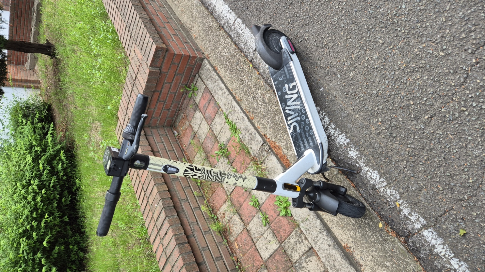
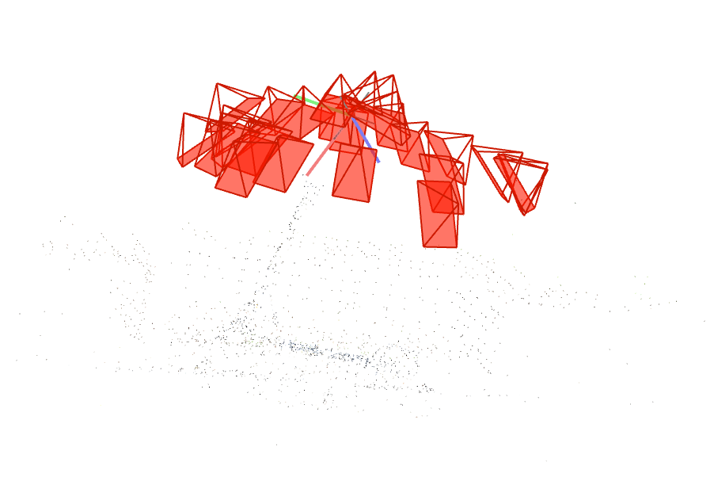
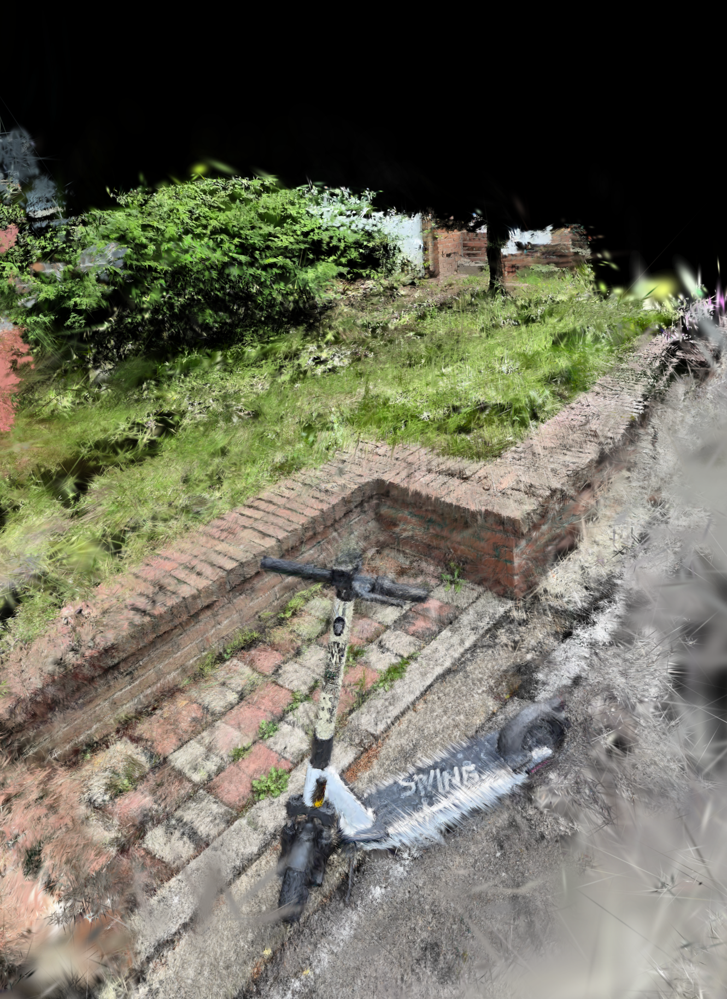

# 3D Reconstruction Pipeline

**SfM → 3D Gaussian Splatting → WebGL Viewer**

스마트폰으로 촬영한 다시점 이미지에서 3D 장면을 재구성하고, 웹 브라우저에서 실시간으로 인터랙티브하게 탐색할 수 있는 end-to-end 파이프라인입니다.

---

## 결과

<table>
  <tr>
    <td align="center"><b>원본 입력 이미지</b></td>
    <td align="center"><b>SfM Sparse Reconstruction</b></td>
    <td align="center"><b>3DGS WebGL Viewer</b></td>
  </tr>
  <tr>
    <td></td>
    <td></td>
    <td></td>
  </tr>
</table>

> 킥보드를 360° 촬영한 25장 이미지로 재구성한 결과입니다.

---

## 파이프라인

```
📸 다시점 이미지 촬영 (스마트폰, 25장)
        ↓
[Stage 1] Feature Extraction — SuperPoint (GPU, ~6초)
        ↓ 장당 ~4,000개 keypoint + 256차원 descriptor
[Stage 2] Feature Matching — SuperGlue (GPU, ~56초)
        ↓ 300쌍 exhaustive matching
[Stage 3] SfM — COLMAP Incremental Mapper (~1.5분)
        ↓ 카메라 포즈 25개 + Sparse Point Cloud 4,880개
[Stage 4] 3DGS 학습 — gaussian-splatting (T4/L4 GPU, ~2시간)
        ↓ 2,758,551개 3D Gaussian (PSNR 25.04dB)
[Stage 5] PLY → .splat 변환
        ↓
[Stage 6] WebGL Viewer — @mkkellogg/gaussian-splats-3d
```

---

## 성능

| 단계 | 방식 | 시간 |
|------|------|------|
| Feature Extraction | SuperPoint (GPU) | **6초** |
| Feature Matching | SuperGlue (GPU) | **56초** |
| SfM | COLMAP Incremental | **1.5분** |
| 3DGS 학습 | 30,000 iter | **~2시간** |

> SIFT CPU 대비 Feature Extraction **120배**, Matching **8배** 속도 향상

---

## 기술 스택

| 분류 | 기술 |
|------|------|
| Feature Extraction | SuperPoint (Deep Learning) |
| Feature Matching | SuperGlue (Graph Neural Network) |
| SfM | COLMAP (Incremental Mapping + Bundle Adjustment) |
| 3DGS | gaussian-splatting (graphdeco-inria) |
| WebGL Viewer | @mkkellogg/gaussian-splats-3d + Vite |
| 학습 환경 | Google Colab (T4 / L4 GPU) |
| 언어 | Python, JavaScript |

---

## 프로젝트 구조

```
├── colab/
│   └── 3D_Reconstruction_Pipeline.ipynb   # SfM + 3DGS 학습 노트북
├── src/
│   └── main.js                            # WebGL 뷰어 진입점
├── public/                                # scene.splat 위치 (git 제외)
├── index.html
├── vite.config.js
└── package.json
```

---

## 로컬 실행

### 사전 준비
- Node.js 18+
- `scene.splat` 파일 (Google Drive에서 다운로드 또는 직접 생성)

### WebGL 뷰어 실행

```bash
npm install
npm run dev
```

`http://localhost:5173` 접속

### scene.splat 직접 생성 (Colab)

`colab/3D_Reconstruction_Pipeline.ipynb` 를 Google Colab에서 열고 순서대로 실행:

1. Google Drive에 `recon3d/images/` 폴더 생성 후 이미지 업로드
2. 런타임 → T4 또는 L4 GPU 선택
3. 셀 순서대로 실행 (SfM → 3DGS → .splat 변환)

---

## 뷰어 조작법

| 입력 | 동작 |
|------|------|
| 좌클릭 드래그 | 회전 |
| 우클릭 드래그 | 이동 |
| 마우스 휠 | 줌 |

---

## 핵심 학습 내용

### SfM (Structure from Motion)
- **Feature Extraction**: CNN 기반 SuperPoint로 각 이미지에서 keypoint와 descriptor 추출
- **Feature Matching**: GNN + Attention 기반 SuperGlue로 이미지 쌍 간 대응점 찾기
- **Incremental Mapping**: PnP로 카메라 포즈 추정, Triangulation으로 3D 포인트 복원
- **Bundle Adjustment**: 재투영 오차 최소화로 카메라 포즈 + 3D 포인트 동시 최적화

### 3D Gaussian Splatting
- SfM sparse point cloud를 초기값으로 3D Gaussian 초기화
- 각 Gaussian: 위치(μ), 공분산(Σ), 색상(SH 계수), 불투명도(α)
- 미분가능 렌더링으로 L1 + SSIM Loss 역전파
- Adaptive Density Control: 자동 split/clone/pruning으로 sparse → dense

---

## 트러블슈팅 기록

| 문제 | 원인 | 해결 |
|------|------|------|
| GPU SIFT 불가 | Colab 헤드리스 환경 OpenGL 차단 | hloc SuperPoint/SuperGlue로 전환 |
| pycolmap API 오류 | v4.x API 대폭 변경 | COLMAP CLI (subprocess) 전환 |
| 3DGS 카메라 모델 오류 | SIMPLE_RADIAL 미지원 | PINHOLE 모델로 재추출 |
| OOM (메모리 부족) | Densification으로 Gaussian 폭증 | densify_until_iter=5000 제한 |
| SharedArrayBuffer 오류 | CORS 헤더 누락 | vite.config.js COOP/COEP 설정 |

---

## 향후 계획

- [ ] MVS (OpenMVS) 추가 → Dense Point Cloud로 품질 개선
- [ ] 실내 공간 촬영 → 가상환경 변환 파이프라인
- [ ] NeRF vs 3DGS 비교 실험
- [ ] 모바일 웹 뷰어 최적화

---

## 참고

- [gaussian-splatting](https://github.com/graphdeco-inria/gaussian-splatting) — Bernhard Kerbl et al.
- [hloc](https://github.com/cvg/Hierarchical-Localization) — Paul-Edouard Sarlin et al.
- [COLMAP](https://colmap.github.io/)
- [@mkkellogg/gaussian-splats-3d](https://github.com/mkkellogg/GaussianSplats3D)
